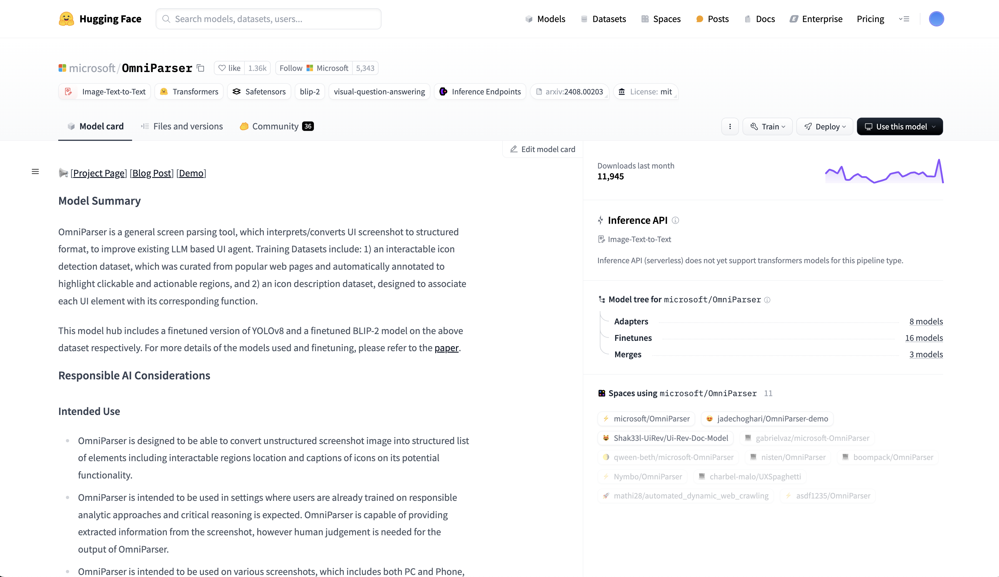
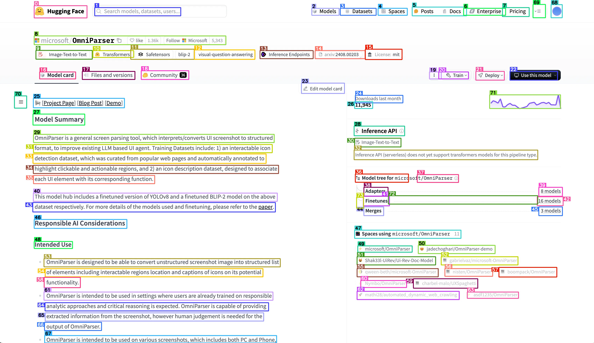

# OmniParser API

Self-hosted version of Microsoft's [OmniParser-V2](https://huggingface.co/microsoft/OmniParser-v2.0) Image-to-text model.

> OmniParser is a general screen parsing tool, which interprets/converts UI screenshot to structured format, to improve existing LLM based UI agent. Training Datasets include: 1) an interactable icon detection dataset, which was curated from popular web pages and automatically annotated to highlight clickable and actionable regions, and 2) an icon description dataset, designed to associate each UI element with its corresponding function.

## Docker Hub
- Image: `sudhar1/omniparser-api:latest`
- Deployment: RunPod GPU Cloud

## Why?

There's already a great HuggingFace gradio [app](https://huggingface.co/spaces/microsoft/OmniParser-v2.0) for this model. It even offers an API. But

- Gradio is much slower than serving the model directly (like we do here)
- HF is rate-limited

## How it works

If you look at the Dockerfile, we start off with the HF demo image to retrive all the weights and util functions. Then we add a simple FastAPI server (under app.py) to serve the model.

## Getting Started

### Requirements

- GPU
- 16 GB Ram (swap recommended)

### Locally
1. create cache directories
    ```shell
    mkdir -p ~/.cache/huggingface
    mkdir -p ~/.EasyOCR
    mkdir -p ~/.paddleocr
    ```
2. Clone the repository:
   ```shell
   git clone https://github.com/SudharS172/omniparser-docker.git
   cd omniparser-docker
   git submodule update --init --recursive
   ```
2. Build the docker image: `docker compose --profile omniparser-cpu build`
3. Run the docker container: `docker compose --profile omniparser-cpu up -d`

### RunPod Deployment

Deploy on RunPod GPU Cloud using the Docker image: `sudhar1/omniparser-api:latest`

## Docs

Visit `http://localhost:7860/docs` for the API documentation. There's only one route `/process_image` which returns

- The image with bounding boxes drawn on (in base64) format
- The parsed elements in a list with text descriptions
- The bounding box coordinates of the parsed elements

## Examples

```shell
curl -X 'POST' \
  'http://0.0.0.0:7860/process_image?box_threshold=0.05&iou_threshold=0.1&use_paddleocr=true&imgsz=640' \
  -H 'accept: application/json' \
  -H 'Content-Type: multipart/form-data' \
  -F 'image_file=@examples/screenshot.png;type=image/png'
```

| Before Image                       | After Image                   |
| ---------------------------------- | ----------------------------- |
|  |  |

